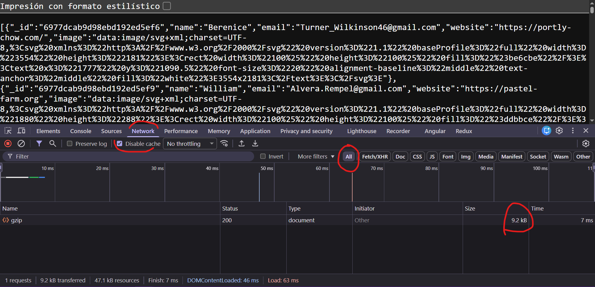

# Optimización

La optimizacion, es tarea del DEVOPS, nosotros como backenders, podemos configurar, o conocer la punta del iceberg, pero es todo un mundo. 

```bash
npm i express-compression
npm i express
```



content-encoding

El navegador lo que haces es reconocer el formato, gzip, brotli y lo autodescomprime.
es como enviar un archivo comprimido, la otra persona para verlo lo tiene que descomprimir 

45