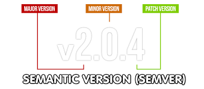
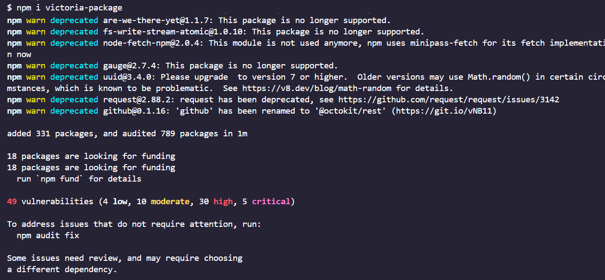

# Administradores de paquetes

Es un software que utilizamos para descargarnos librerias y utilizarlas.

Además, nos permite tener listado en nuestro proyecto, que paquetes usamos, y que quien quieras usarlo con `bash npm i ` pueda hacerlo

El Admin de paquetes, va a leer el package.json, y va a instalar lo que lea ahí dentro

# Npm. Es el que viene con Node

Trae un CLI (Interfaz de Línea de Comandos) en su instalación, que nos permite instalar paquetes o correr nuestro proyecto.

También tiene un repositorio donde guarda las librerias, desde donde trae las que instalamos.

# https://www.npmjs.com/

Esta es la nube donde podemos explorar los paquetes existentes, cómo `express`, o descubrir uno nuevo.

### https://www.npmjs.com/package/express

Todo lo que se instala vía NPM, está en esta web

### Yo trabajo en este paquete https://www.npmjs.com/package/@gcba/obelisco-v2

# Alternativa de NPM. YARN

# https://yarnpkg.com/

Desarrollado con facebook.
Laa intención y el uso es la misma. Algunos dicen que es más rápida

(Se instala vía NPM) 😂

⚠️ En un proyecto, se usa NPM o YARN

```bash
npm i -g yarn
yarn init-y
```

En el sitio de yarn, están los mismos paquetes que en npm

```bash
yarn add express
```

### Igual que npm

```bash
yarn add express@4.5.1 # Versión expecifica
yarn add nodemon -D
```

### Para instalar los paquetes cuando me descargo un proyecto = npm i

```bash
yarn i
yarn
```

### Configuracion de scripts

Es IGUAL a npm, en el packge.json

```bash
yarn start
yarn dev
```

# Profundizando sobre NPM (22)

### package-lock.json - npm ci

Este archivo describe exactamente cuales son las versiones de TODOS los paquetes que esta instalando.

Cuando instalamos un paquete, podemos ver en la web de npm o yarn, que a su vez, usa otros paquetes. Entonces estamos instalando MUCHAS cosas, MUCHAS versiones. Y el -lock.json, lleva un registro de eso.

Si tenemos el package-lock.json, podemos hacer `npm ci`. Y lo que hace es ignorar el package.json e instala exactamente las versiones del lock.json.

Con `npm i` se fija las dependencias listadas e instala la ultima version.

- https://es.stackoverflow.com/questions/2253/qu%C3%A9-significan-los-s%C3%ADmbolos-antes-del-n%C3%BAmero-de-versi%C3%B3n-en-el-package-json

Por defecto, los paquetes se instalan con ^. Eso significa que en cada npm i, actualizará por Major Version

### npm audit

A veces los paquetes tienen vulnerabilidades, y npm audit lo que hace es proponer soluciones. Va a otras versiones delpaquete

# Versionado semantico


https://github.com/gcba/Obelisco-V2/commits/main/

# Conventional commits

https://www.conventionalcommits.org/en/v1.0.0/

# Semantic Release - https://semantic-release.gitbook.io/semantic-release/usage/ci-configuration

# Instalar versión vieja de express

```bash
npm i express@3.20.3
```

si tiro npm audit, me va a encontrar vulnerabilidades

#### ^ - Tope. Major

Si quiero que se quede fijo, en esa versión, le tengo que quitar el ^

#### nada - fijo

`````json
"dependencies": {
    "express": "^5.2.1",
}
```

#### Patch
````json
"dependencies": {
    "express": "~5.2.1",
}```


#### npm outdated
Me audita según el símbolo que yo tenga en las dependencias
```bash
npm outdate
`````

# Creación de un módulo de npm

```bash
npm login
npm publish
```

Si no se tiene la ultima version de npm, va a tener un montón de vulnerabilidades al instalar el paquete


# 🔴⚠️commonjs/module

| Si se usa            | Tipo de módulo | Se consume |
| -------------------- | -------------- | ---------- |
| `export`             | ES Modules     | `import`   |
| `"type": "module"`   | ES Modules     | `import`   |
| `module.exports`     | CommonJS       | `require`  |
| `"type": "commonjs"` | CommonJS       | `require`  |

## Uso del modulo personal de npm

```bash
npm i libreria-victoria-ch
```

1:32:00
