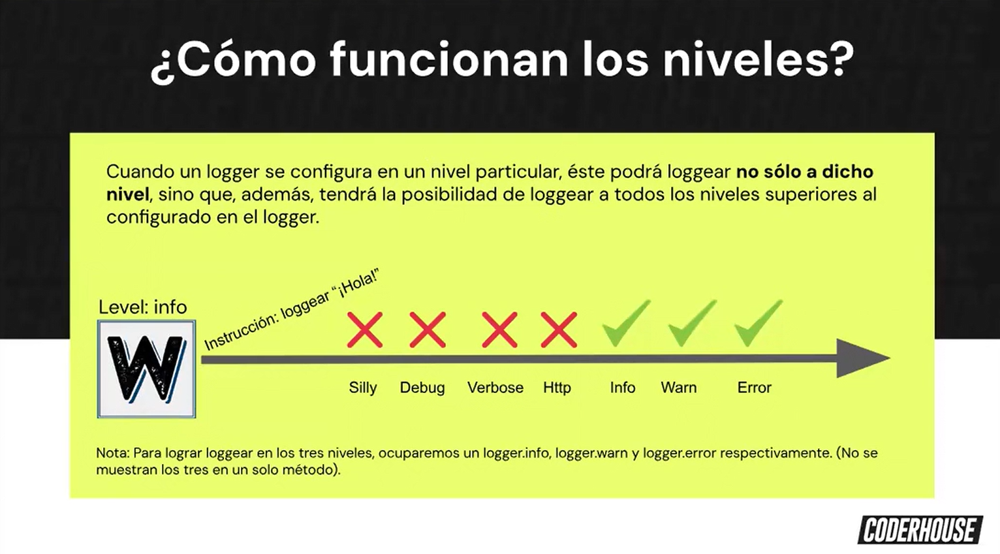

# Winston

## Transportes
Winston se maneja por 'transportes' que vienen a ser los appenders de log4js

los transportes nativos de winston permiten enviarse por otros medios; archivos, enviarse a servidores externos, bdd    

## Niveles
su función es hacer saber al logger qué es importante mostrar 

se pueden personalizar, por defecto trae:

```js
{
    error: 0,
    warn: 1
    info: 2,
    http: 3,
    verbose: 4,
    debug: 5,
    silly: 6
}
```



```bash
npm i winston
```


```bash
npm i winston-mongodb
```

## Formatear los logs 

01:38:00