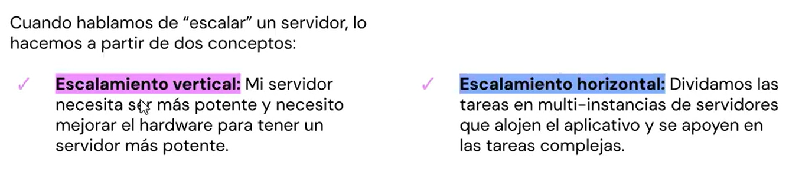
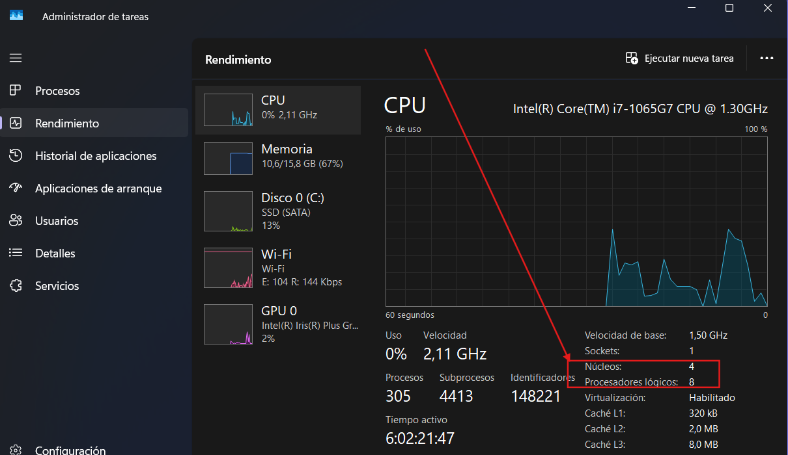
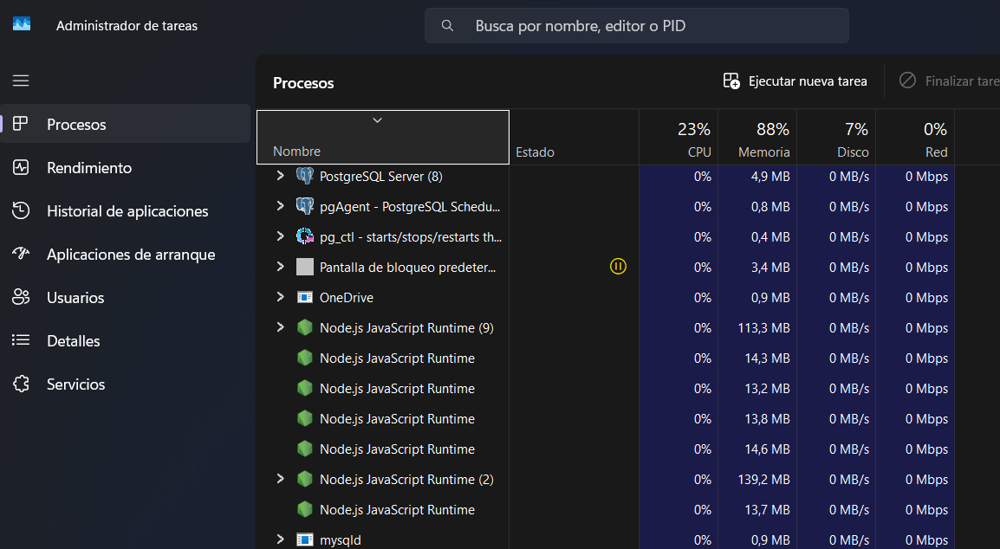

# 04 - Gestión de contenedores y escalabilidad

[PPT](https://docs.google.com/presentation/d/157bL_EvzqERN915jgF7vY-4uPK0O5MBpuOCgG9zi_Ew/edit?slide=id.g120b44b0dae_0_1178#slide=id.g120b44b0dae_0_1178)

Ver cómo implementar mejoras de rendimie7nto

Multiplicación del proceso principal de node, algo que vimos en la clase 01, con global child process.

Vimos que cuando corriamos un proceso muy grande y le daban muchos usuarios a ese endpoint, algunas req fallaban.

No es obligatorio aplicarlo, es para que sepan que existe y se puede implementar

Vimos cómo crear un proceso hijo (fork) para las tareas que demandan más tiempo, de modo tal que el proceso principal se quedaba libre y respondiendo a las req

# 04 - Gestión de contenedores y escalabilidad

# Cluster

PPT 5, tema endoints. Operacion sencilla y compleja

### ¿Qué hacemos para solucionar eso ?

### Escalamiento vertical y horizontal



#### Escalamiento horizontal

Division de tareas en multiples instancias del servidor, para aprovechar lo que ya tenemos.
Es una tarea más compleja. Se utilizan múltiples servidores que trabajan juntos para resolver un problema en particular
Es tener el servidor corriendo en distintos procesos a la vez, para que se repartan las cargas. **Esto se lo conoce como Cluster.**

#### Escalamiento vertical

Agregar hardware a la máquina. Mas memoria, mejor procesador, etc

## ¿Cómo clusterizar nuestro aplicativo?

Ambos son módulos nativos ⬇️

1. Módulo child_process (ya visto)
2. Módulo Cluster. Puedo crear procesos hijos con los métodos del módulo child_process (fork)

La clusterizacion es una estrategia distinta a child process. Con cluster me refiero a los sub procesos que permiten aprovechar al máximo la capacidad del procesador que tiene la pc.

Node.js se ejecuta en un único proceso, un único hilo. Si tengo muchos nucleos

Administrados de tareas > Rendimiento


Monitor de recursos > CPU


La pc tiene X núcleos y el doble de Hilos-procesadores lógicos

Node, usa uno sólo de esos hilos-procesadores lógicos

La idea de cluster, es aprovechar los procesadores lógicos

? Un proceso por cada núcleo

Voy a tener un proceso 'maestro' que se encarga de capturar todas las req y las va distribuyendo a estos procesos hijos que estoy creando a partir de la cantidad de núcleos

## process id

Lo necesito para identificar los distintos procesos que se encargan de una u otra tarea

Para verificar si ese proceso es el principal, o no, necesito del módulo cluster

# Clusterizando nuestro aplicativo

# Módulo nativo cluster

Esto es para tener una idea, no para ser un experto. Esto lo realiza el devop

Para que la aplicación esté productiva, hay que contratar un servicio, ese servicio es una máquina virtual. Que puede tener +-nucleos, rams

[Don web - Cloud hosting](https://donweb.com/es-ar/?ad_campaign=209398715&ad_content=760166907027&pcprovider=google&gad_source=1&gad_campaignid=209398715&gbraid=0AAAAAD6Zr7mboDtyZyGIustaH4InT2fsj&gclid=CjwKCAiA1obMBhAbEiwAsUBbIlobNyfrj_YMRziz2qnpGxUvJCV88rGz57l-wj-kz7MrDPJEl24I0BoCV3cQAvD_BwE)

## isPrimary? - devuelve true o false

Si el proceso es el primario

Quiero que por cada núcleo que tenga disponible, crea un proceso hijo y crear una replica del proceso primario

La 2° tarea del proceso primario es
Poder escuchar si exist un error en estos procesos hijos
Va a estar escuchando el evento 'exit', que ocurre cuando un proceso hijo o 'worker' se cae

Levanto la app
Administrador de tareas > Procesos


Si entro a:

```
http://localhost:8080/operacion-simple
```

Voy a ver que configuré en la ruta, que me devuelva el id del worker, con **idWorker**

Si abro la misma ruta en otra pestaña, me da otro idWorker

```
http://localhost:8080/operacion-compleja
```

Si ejecutaramos los tests de artillery, deberian dar mejor performance
**03_versiones_rendimiento\04_artillery\04_00\artillery.m**

```bash
artillery quick --count 40 --num 50 "http://localhost:8080/operacion-simple" -o 04_simple.json

artillery quick --count 40 --num 50 "http://localhost:8080/operacion-compleja" -o 04_compleja.json
```

## Realizamos un forkeo desde cluster
