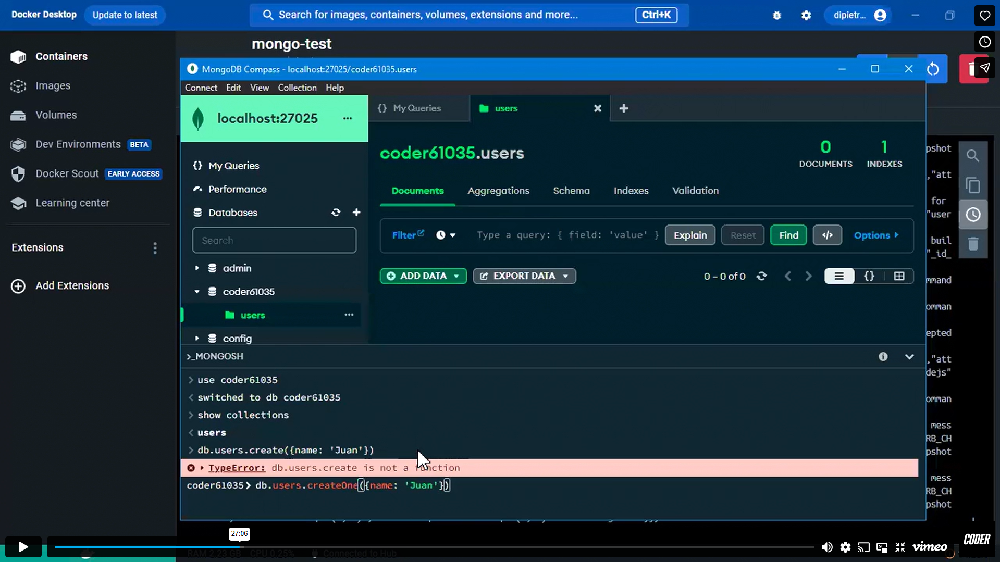

# Contenedores con Docker - https://www.docker.com/

```bash
docker --version
```

Docker es una plataforma que nos permite crear, probar e implementar aplicativos en unidades de software estandarizadas, llamada contenedores.

Con docker vamos a estandarizar, lograr, que nuestra aplicación funcione de la manera correcta, sin importar donde se corra.

Cuando creamos un contenedor en docker va a tener cargado todo lo que necesita para su correcto funcionamiento, con las versiones de node, de bdd.

Para garantizar que levantando ese contenedor en otra pc, va a levantar igual.

Esto se acerca mucho a la problematica que intenta resolver una máquina virtual. La máquina virtual es más pesada, lleva más procesos, cargar el S.O.

Cosas que con herramientas como docker, no son necesarias

La idea es ejecutar entornos que tengan unicamente las configuraciones para ejecutar la app y nada más. Eso se llama contenedor, esto es lo que permite docker

# Contenedor

Entorno de ejecución que va a tener las dependencias necesarias para que la app corra sin tener problemas de compatibilidad

Puede que nos toque compartir un archivo de docker para que alguien pueda levantar nuestra aplicación

# Pasos

(Habiendo instalado docker)

1. Dockerfile - Archivo de configuracion
   Estan todas las instrucciones para que docker genere una imagen del proyecto.

Este archivo está en nuestro proyecto con el que docker va a generar una imagen

Ej: Cómo hacer la imagen de un CD/DVD. Es una copia exacta

2. Acá estariamos haciendo la copia exacta de ) nuestro proyecto. Cuando tengo la imagen de mi proyecto. Puedo hacer, múltiples contenedores de mi proyecto.

3. Contenedor
   Ejecutamos el aplicativo desde el contenedor
   En el contenedor ejecutamos la imagen

Tengo la imagen, y a partir de esa imagen puedo levantar la cantidad de contenedores que necesito

Levanto un servidor dentro de docker con la imagen

# 4 ¿Qué es una imagen base?

Le tenemos que decir que la imagen de nuestro proyecto, la levante con un entorno de ejecución, node.

Esto es para indicarle a docker que a partir de node, levante nuestro proyecto.

Es nuestro `node server.js`, sólo que docker se maneja con imagenes, entonces tengo que decirle que a partir de la imagen de node versión tal, ejecute nuestro proyecto.

## A partir de la imagen, del entorno que le decimos que se ejecute. Una vez allí, todos los comandos disponibles normalmente en node, por ej. Se pueden especificar en DOCKER

! Debe ser la misma que tenemos en el proyecto, con la que iniciamos el proyecto para asegurar su funcionamiento.

```bash
FROM node:22.13.0
```

Así, a secas toma la última versión de node
```bash
FROM node
```

# Propiedades de configuración
- `WORKDIR /destino`: Carpeta que vamos a crear dentro de docker 
- `COPY archivo.txt archivo.js /destino`: Me permite copiar archivos de la carpeta donde estoy ejecutando el docker file y pegarlos en la carpeta que hayamos creado con **`WORKDIR`**. Copiamos archivos desde acá y los pegamos en docker. Se pueden pasar múltiples archivos, el último será el destino donde serán copiados esos archivos.
   - Así, o `./` en vez del `/destino`
Despues de tener los archivos en el destino, tenemos que ejecutar el proyecto, ¿Cómo configuramos eso en docker?
Este paso es el mismo que hacemos despues de clonarnos un repositorio: npm install
- `RUN npm install`: 
Despues de la instalación, quiero que tome todo el código de la aplicación
- `COPY . .`: Copia los archivos del directorio donde estamos ejecutando el dockerfile y lo pega en el `WORKDIR`
### .dockerignore
Misma funcionalidad que .gitignore
- `EXPOSE 4040`: Exponer un puerto para que corra la app
- `CMD` ["npm start"]: Es el comando que va a ejecutar la aplicación. La ejecución del comando final, que se va a ejecutar al momento de correr el servidor, desde docker
o tambien
- `CMD ["node", "./src/server.js"]`: Indico la ruta 

# Cuando tengo listo el dockerfile:
Este comando va a leer el archivo y va a comenzar con la construcción de la imagen de la aplicacion. Una vez que tenga la imagen del servidor va a necesitar un nombre

⬇️ El flag `-t` es -tag, para darle el nombre 
⬇️ el `.` del final, significa que el dockerfile que necesito que lea, es el que está en este directorio

### Comando para crear una imagen
```bash
docker build -t nombre .
```

A partir de acá hay 2 caminos para usar docker, por consola o el docker desktop

## Powershell
Devuelve una tabla listando las imagenes que hemos creado, y va a salir la de recien, con el nombre que le pusimos 
```bash
docker images 
```

En server-test va eso, o las ultimas 4 letras del id  
Despues, el puerto de la pc y el puerto al que apunta el contenedor
```bash
docker run -p 8085:7070 server-test 
```

## DockerDesktop

Botón Run > Desplegable Optional Setting
- Ports: xxxx/7070 el último no me lo deja modificar porque es el que toma de la imagen.
El primero es nuestro EL LOCAL, y el otro es el puerto en que DOCKER lo corre.   

## https://hub.docker.com/search?q=node

Me tira las imagenes disponibles para ejecutar el proyecto

Tomamos una imagen base, del entorno de node, para poder configurar nuestra aplicación.
Esta imagen base, ya existe. Se consume de algún lado, se descarga de un repositorio de imagenes de Docker, dockerhub.

# Recapitulando

Cada contenedor se genera a partir de una imagen, y cada imagen tiene su propia configuracion. Cada vez que instalo una imagen, debo leer su documentación

Este es el comando para descargar e instalar la imagen de Mongo. Una vez que tengo la imagen puedo generar un contenedor.

Lo mismo que hicimos con el docker file del proyecto, generamos la imagen del proyecto y despues la levantamos en un contenedor 

```bash
docker pull mongo # la ultima
```
```bash
docker pull mongo:xx.xx.xx # la ultima
```

El DockerFile es para generar una imagen de el proyecto, en Docker. Una vez que tenemos la imagen, CREADA, que la vemos en Docker Desktop.
Una vez hecho eso, con el botón de run, vamos a generar un contenedor. A partir de esta imagen. Esta img tiene su configuración

El `EXPOSE`, es el puerto en docker.
Cuando en Docker Desktop elijo un Host port, es el puerto de mi PC.

Le doy un nombre al contenedor, y lo que yo levanto es eso, un contenedor, que está creado a partir de una imagen. Donde está toda la configuración, es la imagen.

### Imagen de mongo
En el caso de Mongo, estamos descargango una imagen que ya está hecha y subida al repositorio Docker hub. Levanto un contenedor de Mongo y eso lo podría reemplazar por el Mongo local. 

En el `COPY` puedo indicarle que copie el archivo .env
```bash
COPY .env .env
```
Para que vaya a buscar la variable de entorno de mongo 

### Imagen de Mongo en Docker Desktop
Configuracion de Imagen de Mongo > Port 
Levanta en el 27017 en la PC, puedo elegir otro 

`27025`

Mongocompass corre en el 27017 esa es la bdd local, abro una nueva conexión en `27025` y voy a ver que está vacía, porque esa es la que acabo de crear en Mongo. 


MongoSH
use coderhouse96765
show collections
db.users.insertOne({name: 'Pedro'})

Me voy a los contenedores, busco la mongo-que-cree, la freno. Y la información persiste en la bdd. No se borra nada de la bdd. El contenedor se pausa, la info no se borra.

## DockerHub - 40
Repositorio de imagenes en la nube.

- Genero un dockerfile
- Genero la imagen
- Corro la imagen en un contenedor de docker

Esa imagen la subo a mi cuenta de Dockerhub donde podemos autorizar a que la descarguen o no

# ¿Por qué debería tener mis imágenes en la nube?
En una prueba técnica te pueden pedir compartir la imagen, les pasas el link. En un equipo de desarrollo.

### * traer proyecto de faker *
De 02 > 02_faker

### Comando para crear una imagen
```bash
docker build -t server-faker-96765 .
```
Run > 
- container name 
- puerto - 9000
y levantamos

Esta imagen, la puedo subir a dockerhub

Vamos a ver los logs de nuestro proyecto en la consola de docker

Entramos a dockerhub, nos logueamos
## https://hub.docker.com

# ⚠️ Comando por consola docker

1) Toma las credencales del navegador
```bash
docker login
```

2) Para subir nuestra imagen al repositorio dockerhub
⚠️Tengo que renombrar el nombre que tiene la imagen en mi DockerDesktop
```bash
docker tag tagOriginalACambiar <mi-username>/nuevoNombreTag:1.0.0
```
3) Este comando crea una replica de la imagen tagOriginalACambiar, con el nuevo nombre
```bash
docker push <mi-username>/nuevoNombreTag:1.0.0
```
### Que se descarguen nuestra imagen
4) My profile > Elijo el paquete > Docker Pull Command
```bash
docker pull <mi-username>/nuevoNombreTag
```


# Orquestación de contenedores
Es similar a la clusterizacion de procesos

Acá estamos hablando de contenedores apuntando a la misma app.
Yo genero 5 contenedores de la misma aplicación, con el fin de que se distribuyan las cargas, pero en realidad levanto los contenedores, y funcionan en paralelo, cada uno por su lado. 

La idea es la misma, tenes un controlador y contenedores workers, que sepan, que entre ellos tienen que trabajar para la misma app

## Lógica de clusterización para contenedores - Orquestar 
Cuando utilizamos cluster estamos instanciando un modelo que relaciona, el primary y el worker. En la cual los workers, procesos hijos pueden reiniciarse si se caen.

En la `*orquestacion*` se trata tambien de tener un proceso principal el cúal se encargue de trabajar con workers. Sólo que cada worker es un contenedor. Es lo mismo pero a nivel de contenedores. Por naturaleza trabajan por separado, pero tenemos que lograr la `*orquestacion*`

## ¿En qué son diferentes?
La orquestacion es un proceso más profundo ya que no solo hace una división de tareas, sino que permite realizar una gestión de los contenedores, de una manera más controlada.

## Balanceador de cargas

# Orquestación con kubernetes
Plataforma que sirve para administrar cargas de trabajo y servicios

Toma un conjunto de instrucciones y las va a ejecutar para distribuir *`pods`*

Los *`pods`* tienen `n`, contenedores. De esta forma todos los contenedores que pertenezcan a un pod, podrán funcionar como una entidad unica para intercomunicarse

Ahí es donde se va a estar haciendo esta orquestacion

### Es más sencillo usar kubernetes desde la web, pero algunas funcionalidades son pagas. Asique vamos a descargar algunas herramientas para utilizarlo localmente

## Descargar kubectl
```bash
curl.exe -LO "https://dl.k8s.io/release/v1.25.0/bin/windows/amd64/kubectl.exe"
```

## Verificar versión
```bash
kubectl version --client
```

# Kubernetes 
está pensado para ser desplegado, eso quiere decir que podemos hacerlo desde alguna plataforma en la nube. Pero eso tiene costo, entonces nosotros lo vamos a hacer local. 

## Minikube

# Recapitulando 
*kubctl* --> Kubernets Orquestacion en la nube
*minikube* --> Kubernets local
# Entrega N°1 de proyecto final

01:40:00

- https://docs.docker.com/reference/dockerfile/#copy
- https://docs.docker.com/reference/dockerfile/#understand-how-cmd-and-entrypoint-interact
- https://docs.docker.com/reference/dockerfile/#cmd
- https://www.geeksforgeeks.org/devops/docker-copy-instruction/