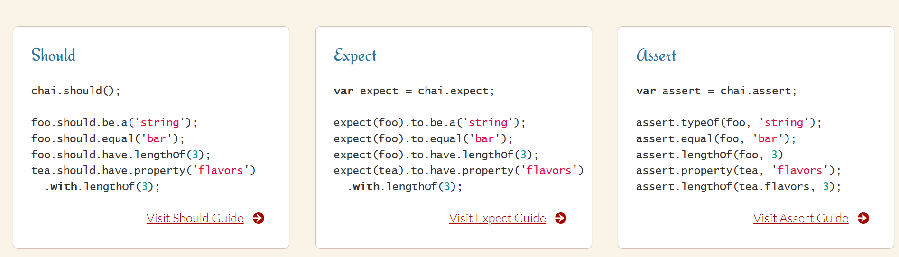

# 06 - Pruebas y Escalabilidad

[PPT](https://docs.google.com/presentation/d/18xHvQXYvCaF57RI_Os6LvgBXbG0gJGhmFkXbekQHnwg/edit?slide=id.g120b44b0dae_0_606#slide=id.g120b44b0dae_0_606)
[Adoptme](https://github.com/CoderContenidos/RecursosBackend-Adoptme)

Al sentarnos a realizar testing, llegamos a un entendimiento más profundo del codigo. Sea nuestro o de otro. Podemos detectar mejoras o mismo errores a la hora de sentarnos a hacer los testings.

- Prueba manual:
  - Abrir postman, poner que url y método quiero ejecutar. Poner el id qué quiero buscar, apretar SEND, esperar la rta. No es automatico

Si tengo muchos endpoints de este estilo, o modifico algo que afecta otra parte del código, en lugar de testear a mano los endpoints sobre los que modifiqué el código y las partes que pueden haberse afectado por la modificación que hice, puedo testear de manera automatica.

Lo ideal es que cuando toco algo del proyecto, volvamos a testear todo de punta a punta.
Si corro las pruebas automaticas y da todo ok es una garantía de que no rompí nada.

# Testing unitario, funcional y de integración

# Testing unitario

Está pensado para funciones aisladas. En las que no se considera el contexto.
Para testear una función en particular o el método de una clase, ahí es donde lo uso el T.U.

💡Sí esa función llama a otras funciones, o hace algo externo, lo que se hace es; Simular la ejecución de esas funciones externas con una rta falsa

Ej: Un método que trae info de la bdd. Simulo que llegan esos datos con su formato

Esto porque el objetivo de esta estrategia de testing es probar el funcionamiento del método individual y no todo el contexto

### Testing unitario del DAO

Testing unitario sobre el DAO de una entidad particular.

En el DAO tengo el CRUD, puedo probar el CRUD, pegandole directamente a la bdd. Pero no estoy probando el endpoint completo. Porque el endpoint se compone de Servicio, Controller, Router, Dao. Sólo pruebo el método del DAO. Que lea, que actualice, que elimine.

# Testing funcional

Comprobamos que la aplicación funciona desde el punto de vista del usuario. Trabajando sobre escenarios del propio producto, a través de lo que es el navegador. No importa la estructura interna del código, sino el comportamiento que se espera de la aplicación. La interfaz del usuario y su funcionamiento

# Testing de integración

Probamos que varias piezas de código ensambladas funcionen correctamente. Verifican que ciertos procesos se comporten de la manera esperada. Podemos probar la aplicación entera, comprobando el comportamiento entre sus piezas.
Probamos un endpoint entero.

Lo que hago por postman, lo puedo hacer con herramientas de testing.

# Mocha - https://mochajs.org/ | ❗ commonjs

```bash
npm i -D mocha
```

## Chai - https://www.chaijs.com/ ❗ commonjs

```bash
npm i -D chai
```

Librería de pruebas para js que se ejecuta en node , con el objetivo de crear test para la aplicación. Funciona igual que `JEST`, que es otro framework

`Mocha` en gral se lo usa con otra librería que se llama `Chai`

#### Chai - Módulo assert/afirmación

Sirve para hacer una **afirmación**, comparo la ejecución de algo con el rtado esperado

Con `Mocha` escribo el test, pero para poder validar que la rta de la función es lo que espero uso otra dependencia.

Node.js tiene un módulo nativo `assert` para hacer estas validaciones, tambien hay dependencias externas que hacen este trabajo. Vamos a usar el assert nativo de node

Estas son 3 formas de plantear los tests, las 3 son válidas. Son iguales, es cuestión de gusto.


| Concepto            | Descripción                                                                                                                                                                                  |
| ------------------- | -------------------------------------------------------------------------------------------------------------------------------------------------------------------------------------------- |
| **Assert**          | Módulo nativo de Node.js que nos permite hacer validaciones de manera estricta.                                                                                                              |
| **archivo.test.js** | La subextensión `.test.js` indica que el archivo será utilizado dentro de un contexto de testing.                                                                                            |
| **describe**        | Función utilizada para definir diferentes contextos de testeo. Podemos tener la cantidad de contextos que deseemos en un flujo de testing, siempre y cuando reflejen intenciones diferentes. |
| **it**              | Unidad mínima de nuestro testing. En ella definimos qué acción se está realizando y cuál será el resultado esperado.                                                                         |
| **before**          | Función que nos permite inicializar elementos antes de comenzar con todo el contexto de testeo.                                                                                              |
| **beforeEach**      | Función que nos permite inicializar elementos antes de comenzar cada test dentro de un contexto particular.                                                                                  |
| **after**           | Función que nos permite realizar alguna acción una vez finalizado el contexto de testeo.                                                                                                     |
| **afterEach**       | Función que nos permite realizar alguna acción una vez finalizado cada test dentro del contexto particular.                                                                                  |

# Testing de integración

`supertest` es quien ayuda a conectarse a la app, levantar la app y hacer las solicitudes a los endpoints. **se ejecutan los test con `jest`**

```bash
npm i supertest
```

`modulo request` de `supertest`. pero se podría hacer tambien con fetch o axios
`jest` para correr los tests

❗debemos exportar la app
preferentemente tener en commonjs, para que jest lo entienda mejor

Involucra todos los componentes necesarios para desarrollar una funcionalidad que va a ser consumida por un usuario final. En ese caso es un test funcional. Porque no testeo componentes sueltos sino una funcionalidad.

Los tests integrales se relacionan con la documentación. Así como documento los endpoints de la api, voy a testear los endpoints de la api


Pendiente
- (Ya armado, PROBAR) armar ejemplo de dao (usar los metodos del dao y ver que se haya guardado ok) son las pruebas que se hacen manualmente en postman
- (Ya armado, PROBAR) assert de node 00:30:00

testing avanzado:
00:50:00