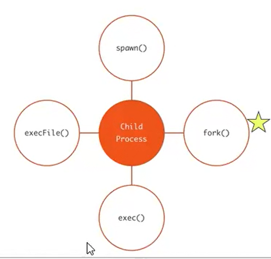
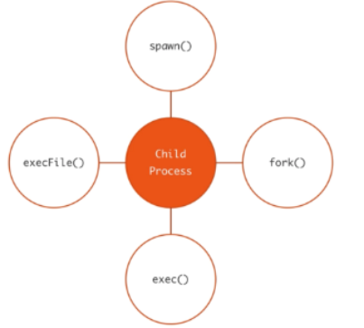

Vídeo: 05 - Clusters & escalabilidad 70285
Clase 04 - Tutora
https://docs.google.com/presentation/d/184r2z3yYw79uWiiPAuM1XTE_rOTLbdMLA9O1qso7RdE/edit?slide=id.g120b44b0dae_0_606#slide=id.g120b44b0dae_0_606 

Performance, ante muchas peticiones algunas fallaban
Módulo Cluster: Nativo de node

Escalamiento vertical (fisico): Mi servidor necesita ser más potente y necesito mejorar el hardware para tener un servidor más potente.

Escalamiento horizontal: Dividamos las tareas en multi-instancias de servidores que alojen el aplicativo y se apoyen en las tareas complejas.

La escalabilidad horizontal significa utilizar múltiples servidores, conocidos como nodos, los cuales trabajarán en equipo para resolver un problema en particular. 

servidores = nodos.
muchos nodos = cluster
 

¿Cómo clusterizar nuestro aplicativo?

Cada vez que corro un proceso de node, se crea el objeto process que tiene un monton de metodos, propiedades con informacion del trabajo que estaba realizando  node. Entre ellos el id, si tengo múltiples instancias del servidor, multiples procesos, me interesa saber el id

Módulo nativo cluster

