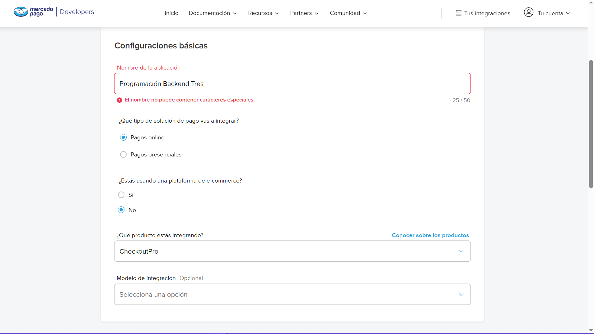

# [Clase 0 - Proceso principal del servidor + Global & Child process](https://docs.google.com/presentation/d/1XCiSJSKWi__SIFK4qMaEj8ooaRqRz5yvYETUTqO6ecU/edit#slide=id.g29847e995f9_0_69)

### Mercado Pago - Checkout Pro | Pasarela de pago
[Documentación MP](https://www.mercadopago.com.ar/developers/es/docs/checkout-pro/landing)
[Integración](https://www.mercadopago.com.ar/developers/es/docs/checkout-pro/requirements)
[Certificacion Checkout Pro](https://www.mercadopago.com.ar/partners/developers/certifications/checkout-pro)
* Server Discord MP
```bash
# npm i express mercadopago cors
npm i express
npm i mercadopago
npm i cors
```
```bash
# A mi me gusta más require para el backend
  "type": "module",
```

### Back urls
Las `back_urls` son URLs de retorno al sitio que se configuran para redirigir al comprador después de completar el proceso de pago.  Luego de pagar, que lo redireccione al sitio.

Pueden ser distintas URLs para los distintos casos 

- Los escenarios posibles para estas URLs son:

- 🟢 success: URL de retorno cuando el pago es aprobado.
- 🟡 pending: URL de retorno cuando el pago está pendiente. Rapipago | ventanilla
- 🔴 failure: URL de retorno cuando el pago es rechazado.
  
Para pagos aprobados con tarjeta de crédito, se puede configurar una redirección automática usando el atributo auto_return con el valor approved. El tiempo de redireccionamiento es de hasta 40 segundos y no puede ser personalizado. Para otros métodos de pago, la redirección no es automática, pero se puede utilizar el botón "Volver al sitio".

Es importante no usar dominios locales en back_urls, como localhost o 127.0.0.1, para evitar errores al finalizar el proceso de compra. Las back_urls se pueden configurar a través de SDKs o mediante la API de preferencias enviando un POST al endpoint /checkout/preferences.

### Crear credenciales
[Tus integraciones](https://www.mercadopago.com.ar/developers/panel/app)



¡Se llama Comprador App pero son las credenciales de vendedor!


El Public Key va en el front
El Access Token en el back


## Empezar
```bash
 cd server_mp
 npm run dev
```

### Mi cuenta oficial de MP tiene:
- Los usuarios de prueba
EN MODO INCOGNITO
- Con el vendedor: Inicio sesion en [mercadopago/developers](https://www.mercadopago.com.ar/developers/es)
  - Creo una aplicación
  - Una vez creada, uso las credenciales de producción de mi vendedor fake
  - El publick key y access token
- Con el usuario: En mercado pago normal cómo si fuera un usuario


Mucho potencial tiene este proyecto